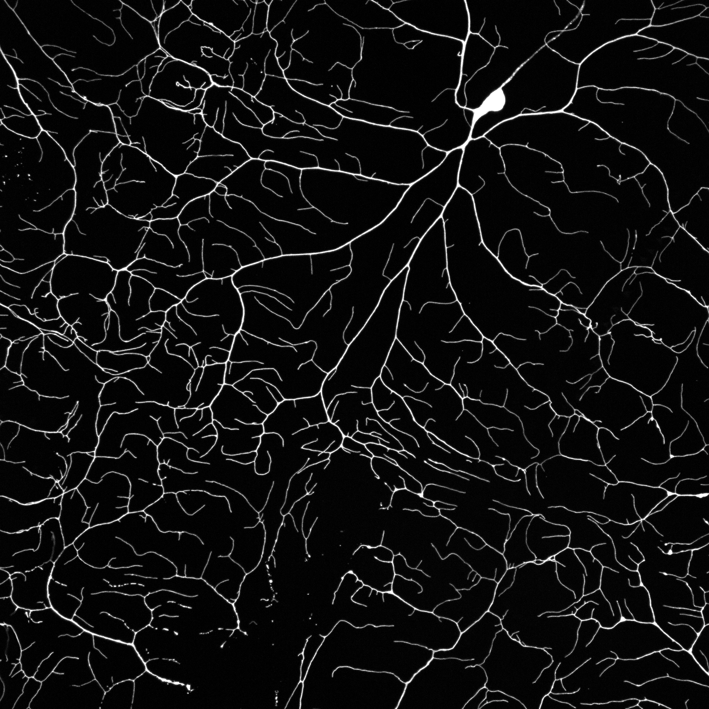
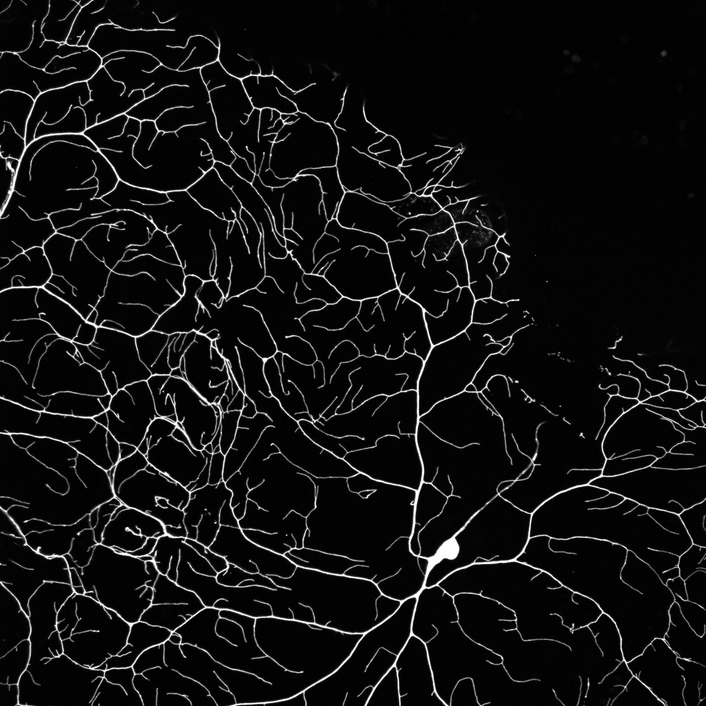
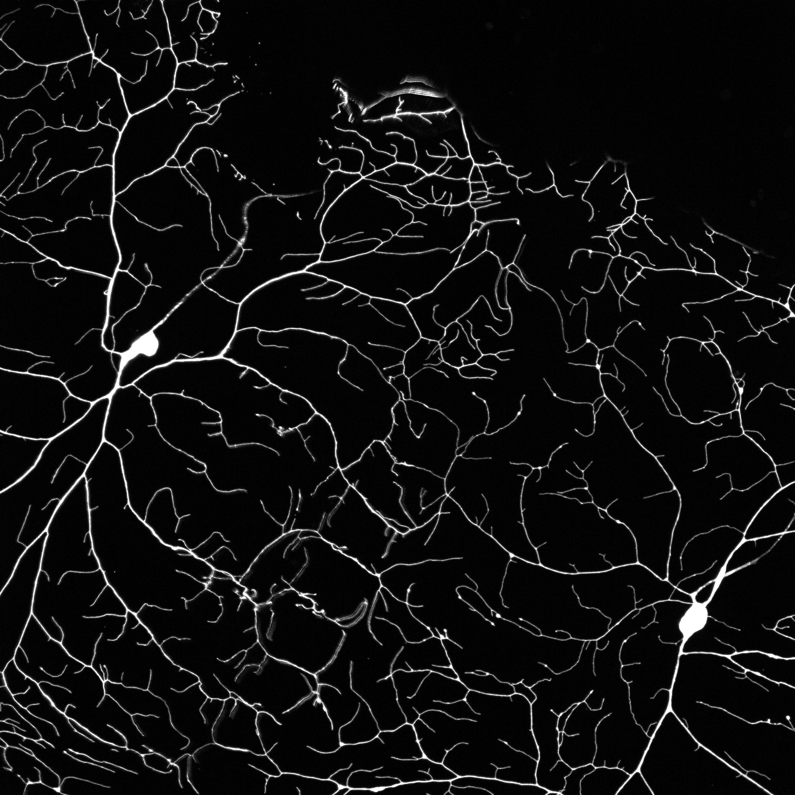

# Neuron Image Stitcher
A MATLAB script to stitch many gray-scale images of neurons using local displacement fields.

The backbone of the algorithm uses the built-in MATLAB function [imregdemons](https://www.mathworks.com/help/images/ref/imregdemons.html) in the image processing toolbox. In its minimal form, this script is a wrapper of `imregdemons` with extra image processing to help the alignment prior to calling `imregdemons` and ensure continuous pixel intensities at the patches' boundary.

The algorithm stitches each image onto the most updated version of the final image.

## Installation
- Install the following toolboxes:
```
Symbolic Math Toolbox
Image Processing Toolbox
Partial Differential Equation Toolbox
Computer Vision Toolbox
```
- Clone this repository in your MATLAB directory.

## Compatibility
The script was developed and run in MATLAB Version 9.6.0.1174912 (R2019a) under Mac OS X. Compatibility with previous versions of MATLAB and different OS have not been tested.

## Usage
- Import all images and store them in a cell array (eg. `Images`). Each entry of the cell array must be a double or unsigned integer matrix (2D array).
- Run the following to stitch all images:
```
Image_stitched = stitch_all(Images);
```

## Performance
The following images are included in the `images` folder as an example:

(Image examples coming soon)

  

The resulting stitched image is:


This algorithm was tested on a set of 16 bit images with a constant exposure time. The performance displayed may not generalized due to difference in image features such as noise or pixel intensities. In this case, changing the parameters of the `imregdemons` call in `stitch_pair` may improve the performance.


## Acknowledgement
We thank Sonal Shree ([Google Scholar](https://scholar.google.com/citations?user=9wAaRw8AAAAJ&hl=en), [ORCID](https://orcid.org/0000-0002-5665-8157)) for providing us with images of Class IV neurons using confocal microscopy.
